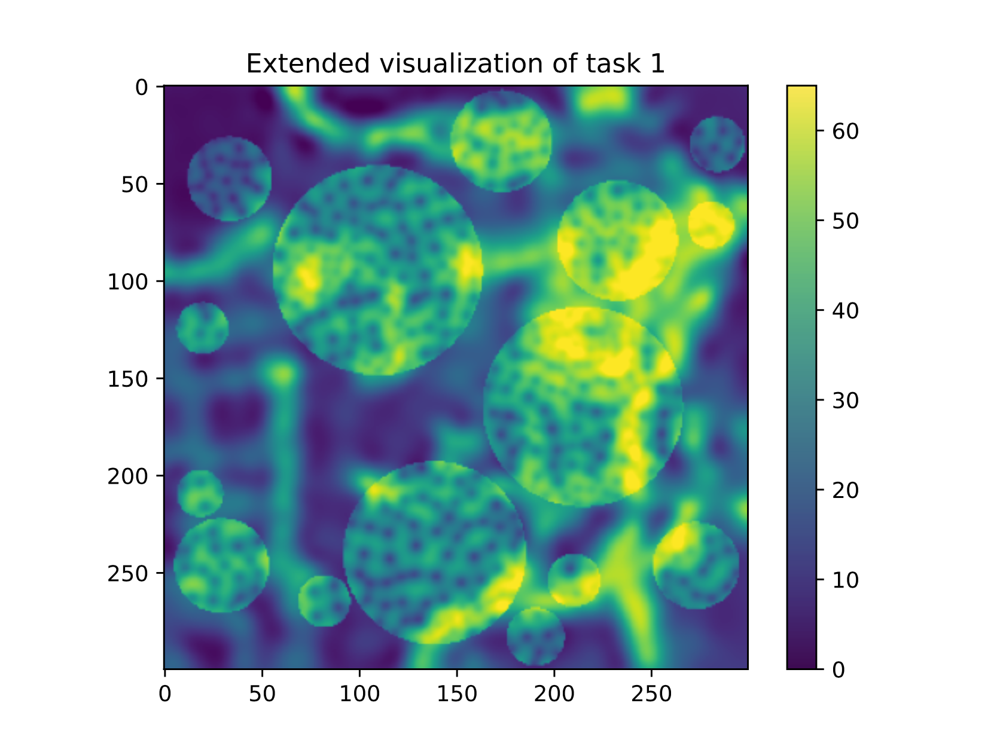

# Probabilistic Artificial Intelligence 2023 - ETH

## Task 1: Gaussian Process Regression

The task was to predict the pollution at different locations in a 2-dimensional map. Additionally, there are areas where we cannot underpredict the pollution.
This is modelled within the cost function, where a wrong prediction normally simply is calculated as L2-loss, however if we underpredict in an important area, we incur a way larger cost (weighted 50 instead of 1).

To solve this task, we mainly tried a lot of different kernels for the GPRegressor (Matern, RGB, Linear and combinations of those).
To make sure we never underpredict we additionally add an additional factor of the standard deviation (in our case a factor of 1.75 led to the best result) to important locations.
To additionally improve our position on the leaderboard, we then used multiple different GP regressors for the different locations on the grid.
In our case we simply split the area into 4 equally sized regions and predict each on its own.

## Task 2: Bayesian Neural Networks

## Task 3: Bayesian Optimization

## Task 4: Reinforcement Learning
