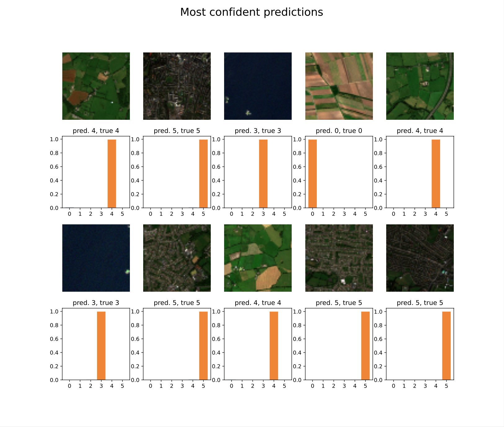
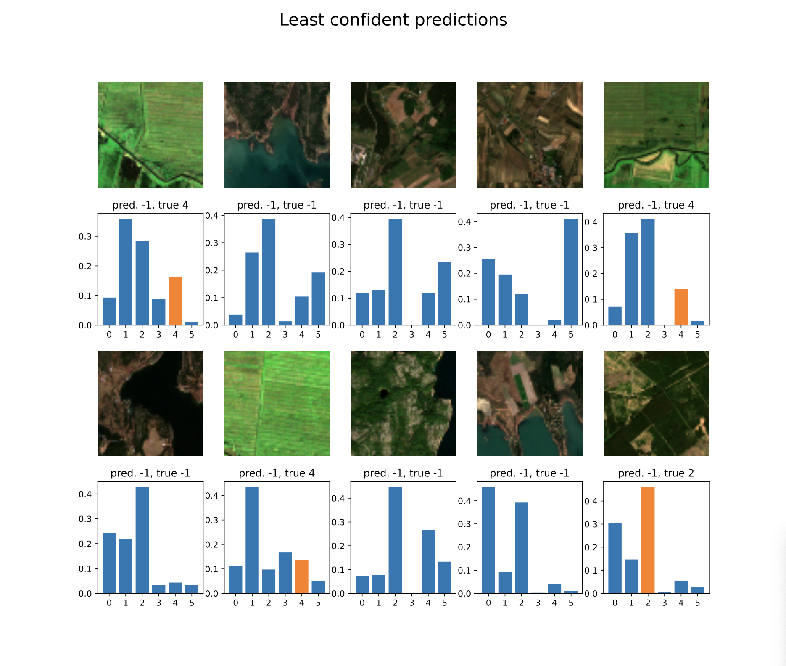
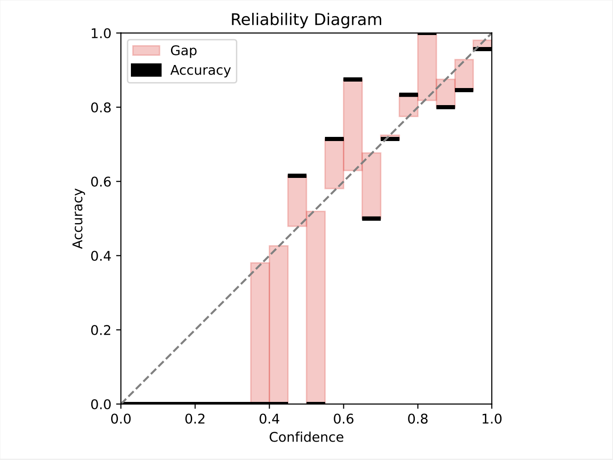
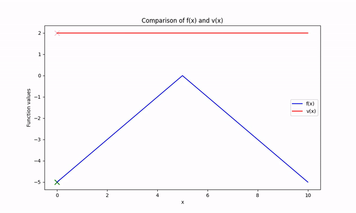
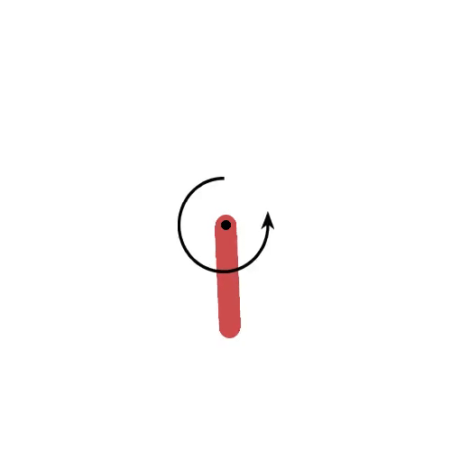

# Probabilistic Artificial Intelligence 2023 - ETH

## Task 1: Gaussian Process Regression

The task was to predict the pollution at different locations in a 2-dimensional map. Additionally, there are areas where we cannot underpredict the pollution.
This is modelled within the cost function, where a wrong prediction normally simply is calculated as L2-loss, however if we underpredict in an important area, we incur a way larger cost (weighted 50 instead of 1).

To solve this task, we mainly tried a lot of different kernels for the GPRegressor (Matern, RGB, Linear and combinations of those).
To make sure we never underpredict we additionally add an additional factor of the standard deviation (in our case a factor of 1.75 led to the best result) to important locations.
To additionally improve our position on the leaderboard, we then used multiple different GP regressors for the different locations on the grid.
In our case we simply split the area into 4 equally sized regions and predict each on its own.

The picture below visualizes the predictions. One can clearly see the regions where we are not allowed to underpredict (the circles which appear slightly lighter).

## Task 2: SWA-Gaussian

In this task, we had to predict aerial images of landscapes into 6 different classes. Additionally there are training samples which do not belong to a certain class and are classified as "ambiguous".
The loss of the model is then calculated as a combination of the ECE (Expected Calibration Error) and a loss based on the predictions, where predicting ambiguous (e.g., -1) incurs a fixed cost and wrongly predicting a non-ambiguous sample incurs a larger fixed cost.

To solve this we implemented SWAG according to the paper linked in the project description ([A Simple Baseline for Bayesian Uncertainty in Deep Learning](https://arxiv.org/pdf/1902.02476.pdf)).
We first implemented SWAG diagonal, to get a first working solution, which was sufficient to pass the medium baseline, and afterwards we implemented SWAG-Full to pass the hard baseline as well.
Fixing the prediction threshold to $\frac{2}{3}$ led to the best results on the leaderboard.

The pictures below show the most and least confident predictions and additionally a reliability diagram for our model.

  
  

## Task 3: Bayesian Optimization

The task was to find the maximum value of some objective function while respecting certain constraints. Evaluating any function value that is not within a constraint is very expensive and is thus heavily penalized.
Ideally, we would be able to find the maximum value of the objective value without ever evaluating the function at a point that is not within the constraint.
To model this we use 2 Gaussian Processes (one for the objective function and one for the constraint function).
Whenever we add a new datapoint, we fit both GPs again with all data that we currently have.
To recommend a next point, we tried two different acquisition functions, namely Expected Improvement ("EI") and Upper-Confidence Bound ("UCB").
For UCB we simply use the objective GP to predict the mean and the standard deviation. The UCB is then defined as $UCB = mean + \beta \cdot std$, where $\beta$ is a hyperparameter.
We then use the constraint GP to check if we are potentially violating a constraint. If so we drastically reduce the value of the prediction to assure we do not pick this point.
For EI we proceed in exactly the same way, except for the calculation of the EI value.
From our tests we found out that UCB worked better for this specific usecase.

The video below shows the first 30 recommended points of a very simple toy example where $f(x)$ represents the objective function and $v(x)$ represents the constraint function.

## Task 4: Reinforcement Learning

In this task we were asked to train a Reinforcement Learning agent that swings up an inverted pendulum and balances it there.
The only control the agent has is a motor that can apply torques.
To solve this task we implemented the off-policy SAC algorithm. A lot of the code was already provided through the template provided in the exercise.

The GIF below shows the final trained agent and how it balances the pendulum once its upright.

